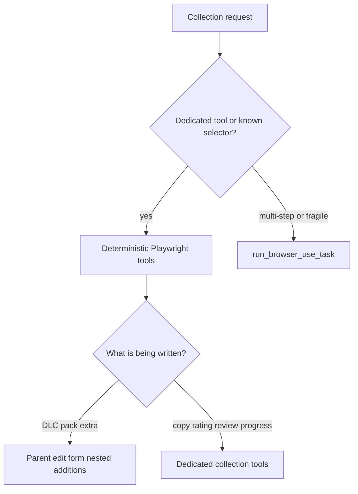

# Infinite Backlog MCP (for agents)

Public repository: never commit cookies, API keys, private URLs, or session material.

This file is for assistants **calling** the `infinitebacklog` MCP tools. Humans installing the server should use [README.md](README.md). Runtime MCP `instructions` stay on the server; treat this file as the fuller operating brief.

## Purpose

Hybrid [Playwright](https://github.com/microsoft/playwright) MCP for [Infinite Backlog](https://infinitebacklog.net/). Infinite Backlog has no public write API, so collection changes go through a real Chromium session. After login, nested extras can be audited with read-only `GET /api/user_collections`.

Navigation, cookies, in-page fetches, and `run_browser_use_task` are locked to `https://infinitebacklog.net`. Off-origin URLs are rejected.

## Pick a tool

Use deterministic Playwright tools first. They are precise and do not spend an extra LLM call. Use `run_browser_use_task` only when the goal is multi-step or the UI path is fragile (for example, "find unfinished JRPGs and summarize playtime"). That tool needs `browser-use` plus an LLM key, and it still must stay on infinitebacklog.net.

Concurrent tool calls share one browser and run under a lock. Do not assume parallel clicks or fills.

| Goal | Tool |
| --- | --- |
| Open an IB path or show a login window | `open_site` |
| Catalog search | `search_games` |
| List DLC / packs / extras on a game page | `list_related_content` |
| Read Add DLC / owned DLC / addon boxes on an edit form | `list_collection_content_menus` |
| Attach nested extras to a parent game | `add_game_content` |
| Read copies, ratings, progress, acquisition, Play Records (no save) | `list_collection_game_options` |
| Set or clear 1-10 plus sub-ratings | `set_game_rating` |
| Draft or publish a review | `add_game_review` |
| Delete a **draft** review | `delete_game_review` |
| Extra platform copy | `add_game_platform_copy` |
| Per-copy status, completion, bar, notes | `set_game_progress` |
| Acquisition Info | `set_game_acquisition` only |
| DELETE GAME for a saved copy | `delete_game_copy` with `confirm=true` |
| Play Records | `list_play_records`, `set_play_record_category`, `set_play_record`, `remove_play_record` |

Simple reads and known selectors (`get_page_text`, `click`, `fill`) stay on the deterministic path.

## Session

- Session already present (user pointed at a signed-in tab, or cookies already in the environment): reuse it. Headless is fine unless they asked for a visible window.
- Login still needed: `open_site(..., headless=false)` so they sign in inside MCP Chromium. Later calls reuse that session.
- Never ask a human to copy, export, or paste cookies from DevTools.
- `IB_COOKIES` and `set_cookies` only when a cookie JSON array is already in the environment. Domains must be `infinitebacklog.net`.
- A logged-in Brave tab via CDP is a separate attach path. This server does not launch it.

Public catalog pages work without login. Ratings, reviews, and collection writes need a signed-in session.

## Collection model (live IB v1.13.6)

DLC and packs are **nested `additions` on the parent collection row**, not standalone collection games.

- `GET /api/user_collections?user_id=...&game_id=<DLC>` is empty even when that DLC is owned.
- `already_owned` is parent `additions[]` (and the edit form Owned DLC list).
- `/games/add/{dlc-slug}` SPA-redirects to `/games/{slug}`. There is no add form.
- Parent edit path: `/users/{user}/collection/{parent-slug}/edit?id={collection_id}`
- Pick extras from **Add DLC to your game**. Tick **ADDONS/PACKS** labels only when they are unchecked. Click **UPDATE GAME** once.
- During `add_game_content`, do not click **DELETE GAME**, fill Acquisition Info, or change edition / Digital-Physical / play status.
- If a title is missing from DLC, search PACK/ADDON, EDITIONS, extra-content checklists, and every other live related tab and extras dropdown before `not_found`. Skins are often packs, not DLC. An edition extra lives under EDITIONS; never switch the parent edition.
- Nested extras are add-only in this pass. Do not auto-untick owned DLC.
- Ratings and reviews are per IGDB game, not per platform copy. Extra copies are extra `POST /user_collections` rows via `button.extra-platform`, not nested additions.
- Progress (status, completion, bar, notes) is per copy on the collection edit form.
- IB hides `.collection-rating` while Unplayed or No Status. `set_game_rating` locally sets Playing on the edit form (no UPDATE GAME) then restores status.
- Play Records live at `/collection/{slug}/edit/stats` (`li.stats-link`). Categories are per-game (`keyValue` / `checkbox` / `progress` / `table`), not a profile library.
- Only `set_game_acquisition` writes Acquisition Info. Only `delete_game_copy` clicks DELETE GAME, and only with `confirm=true`.

## Security and bounds

- Unofficial project. Not affiliated with Infinite Backlog.
- `evaluate_js` is off unless `IB_ALLOW_EVAL_JS=true`. Screenshots write only under the OS temp `infinitebacklog-mcp` directory. Chromium `--no-sandbox` is opt-in via `IB_CHROMIUM_NO_SANDBOX` (containers).
- Generic `click` / `fill` cannot drive DELETE GAME, DELETE DRAFT, YES/NO confirms, UNLOCK CUSTOM TAGS, or password fields. Dedicated delete tools still require `confirm=true`.
- Be polite with request rate.
- SPA pages often need a short wait after navigation. About 281 characters with no `h1` is Vue chrome. Wait for `h1`, `#game-search`, or more text. On an edit form, wait until **UPDATE GAME** is visible.
- Catalog search is `#game-search` (placeholder "Search for a game") with the Vue native value setter. Do not fill `#platforms-search` (sidebar filter). Live filter is `/games?q=`. `/games?search=` does not filter.
- Duplicate titles use IGDB-style slugs (Hades 1995 is `hades`, Hades 2020 is `hades--1`).
- `list_related_content` clicks only `ul.related-games-nav` tabs (href is often empty) and must stay on `/games/{slug}`. A page-wide EDITION/DLC label is a card link to another game.
- Collection rows use `/users/{user}/collection/{slug}?id={collection_id}`. **WRITE A REVIEW** on the edit form goes to `/games/{slug}/add-review`. Publish needs 800+ characters. **DELETE DRAFT** confirm is **YES**.
- If a control would write the user profile, settings, widgets, **UNLOCK CUSTOM TAGS**, Play Records **SETTINGS**, or a global tag/category library, return `profile_scope` and stop. Do not edit `/settings`.
- `delete_game_review` deletes a draft (`confirm=true`). Published reviews are `profile_scope` unless the caller named them.
